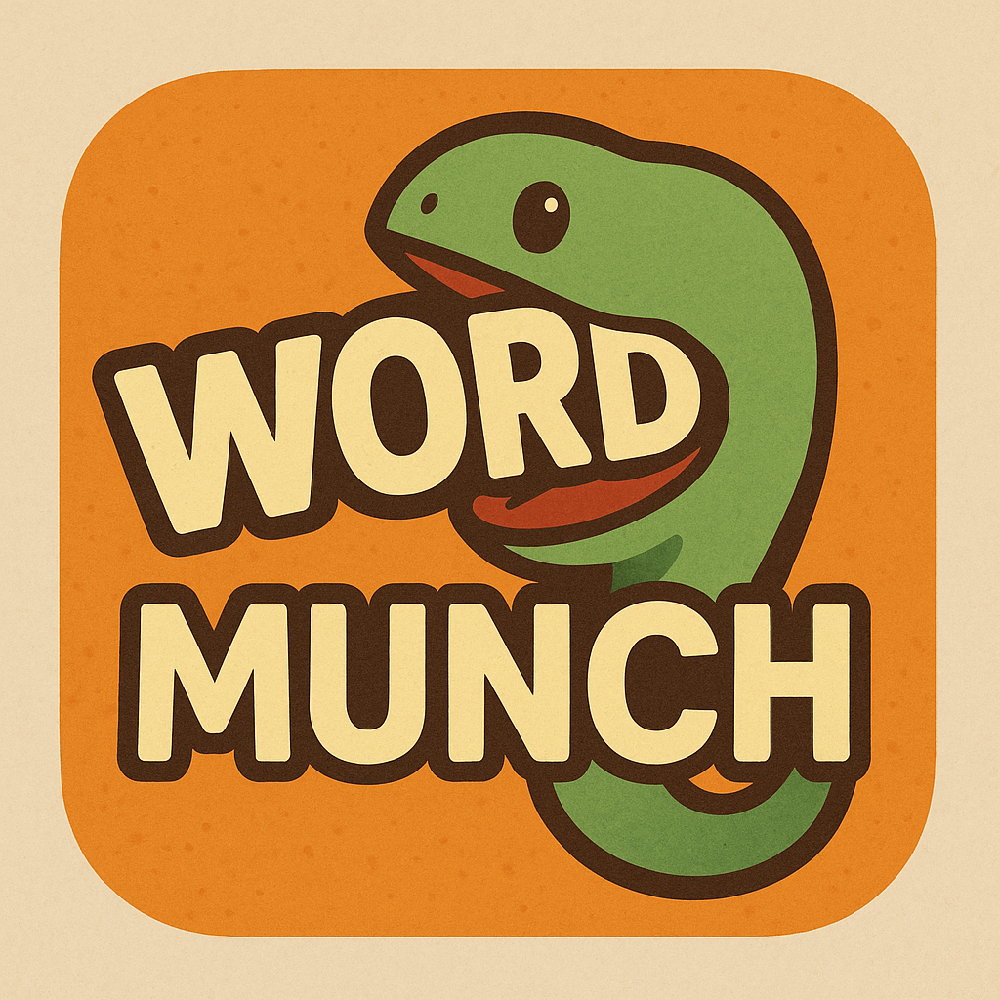
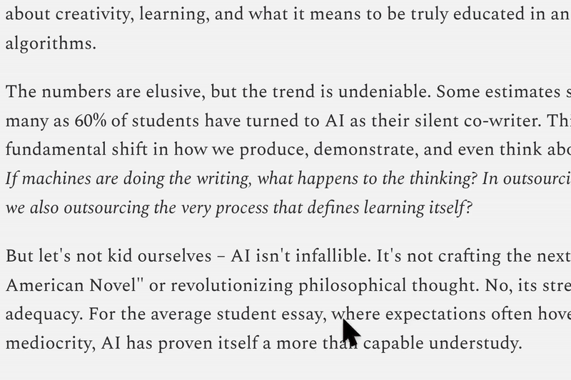
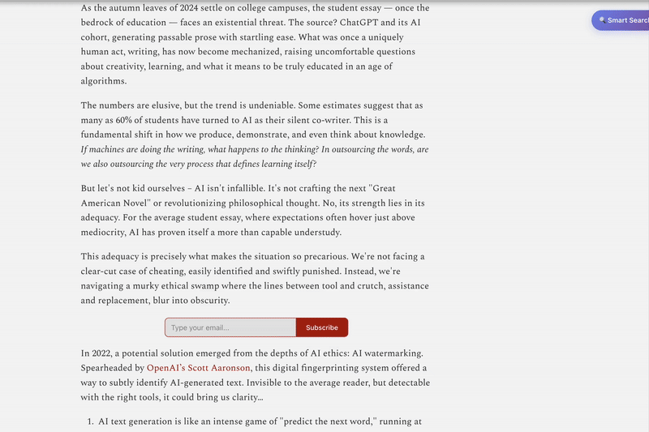
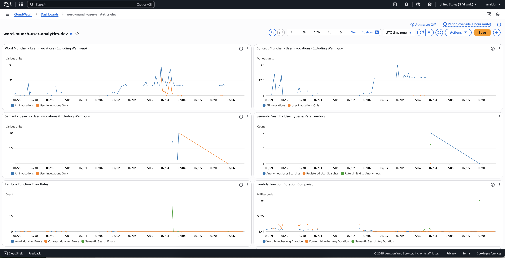

<div align="center">
  
  
  # Word Munch
  
  **Read smarter, not harder**
  
  <a href="https://chromewebstore.google.com/detail/word-munch/kkcmcbpndfgiainfpocpoajlhalpiodl">
    
  </a>
  
  <a href="https://youtu.be/1pjkhEv0V94">
    
  </a>
  
  *• Click • Retrieve • Simplify • Understand*
</div>

## 🎯 The Problem

2 AM. AWS documentation. Confusing sentence.

*Tab. Copy. Paste. ChatGPT. Answer. Tab back.*

Reading flow? **Dead.**

*"Where did they explain the authentication earlier?"*

Digital archaeology: endless scrolling, Ctrl+F battles, re-reading entire sections.

**The irony:** Using AI to think for you, then using your brain to do what computers excel at.

**Word Munch fixes this:** AI handles information retrieval and digestion while your mind focuses on actual thinking.

## ✨ Features

### 🤖 **Word Munch: The Information Retrieval and Digestion Tool**

Word Munch finds the right information and transforms it into digestible form—so you can focus on understanding and high-level thinking.

### 🧠 Five Smart Reading Tools

#### 1. **Word Muncher** - Context-Aware Vocabulary
Click unknown words → get simplified, context-aware synonyms → connect to what you already know

<div align="center">
  
</div>

#### 2. **Concept Muncher** - Comprehension Verification
Write your understanding → get instant feedback + simplified sentence structure → know if you really get it

<div align="center">
  
</div>

#### 3. **Semantic Search** - Intelligent Content Discovery
Ask questions → find answers by meaning (not just keywords)

<div align="center">
  
</div>

#### 4. **Chunk Reading** - Cognitive Load Management
Long articles → bite-sized pieces → no cognitive overload

<div align="center">
  
</div>

#### 5. **Learning Insights** - Personal Analytics
Track your reading patterns → understand your learning style

<div align="center">
  
</div>

#### 6. **Real-time CloudWatch Dashboard** - Production Monitoring
Tracking user activity across all 5 Lambda functions

<div align="center">
  
</div>

## 🚀 Quick Start

1. **[Install from Chrome Store](https://chromewebstore.google.com/detail/word-munch/kkcmcbpndfgiainfpocpoajlhalpiodl)**
2. **Visit any webpage**
3. **Click the Word Munch icon**
4. **Start reading smarter**

No setup required!

## 🎯 Why It Works

| Cognitive Task | Traditional Reading | AI-Only Tools | Word Munch Division | Result |
|----------------|-------------------|---------------|-------------------|---------|
| **Unknown words** | Stop, search, lose flow | AI explains, you stay passive | AI simplifies → You connect | 📈 **Knowledge bridges** |
| **Complex concepts** | Re-read, get confused | AI thinks for you | You think → AI gives feedback + simplified sentence structure | 📈 **Active learning** |
| **Finding info** | Ctrl+F, miss context | AI scans doc and answers | You ask questions → AI locates answers → You analyze | 📈 **Deep comprehension** |
| **Long articles** | Overwhelm or quit | AI summarizes, you miss nuance | AI chunks → You digest | 📈 **Sustained focus** |

**Key Innovation:** Perfect cognitive division of labor—AI handles information retrieval and simplification, you handle information understanding and analysis.

## 🔬 The Science

**Cognitive Load Theory:** 70% of reading energy wasted on mechanical processing tasks.

**Word Munch's fix:** Systematic cognitive offloading of low-level tasks (vocabulary lookup, sentence parsing, information location, content chunking) so 95% of your mental resources go to actual understanding and insight generation.

**Result:** 95% mental resources for actual thinking.

## 🏗️ Built With

```
Chrome Extension → API Gateway → 5 Lambda Functions → DynamoDB + Cache
                                         ↓
                                 Bedrock Models (Nova, Titan, Claude)
                                         ↓
                                CloudWatch Monitoring
```

## 🔧 Technical Highlights

### Why Lambda is Perfect for This Problem

**Reading patterns = Serverless patterns:**
- 📚 **Burst activity** during focus → Lambda auto-scales
- 🤔 **Quiet periods** → Lambda scales to zero  
- 💡 **Instant answers** → Lambda optimized for speed
- 💰 **Cost efficiency** → Pay only for thinking time

### Lambda Functions Architecture

| Function | Model | Memory | Lines | Purpose |
|----------|-------|--------|-------|---------|
| **Word Muncher** | Nova Micro | 512MB | 658 | Simplify context-aware synonyms |
| **Concept Muncher** | Titan v2 + Claude | 1024MB | 1,274 | Comprehension analysis + simplified sentence structure |
| **Semantic Search** | Titan v2 | 1024MB | 568 | Document semantic search |
| **Cognitive Profile** | Analytics | 1024MB | 1,217 | Learning patterns |
| **User Auth** | JWT | 512MB | 551 | Security |

### Performance Optimization

- **Lazy Loading** - global variables with on-demand client initialization
- **Connection Reuse** - 4 cached clients across invocations  
- **EventBridge Warming** - 3-minute ultra-lightweight cycles
- **3-layer frontend caching** (Memory → Data → IndexedDB) for 99% hit rate

### Model Selection: AB Testing Results

**Problem:** Which AI model provides the best balance of speed, accuracy, and cost?

| Model | Accuracy Score | Cost per Word | Avg Response Time | Result |
|-------|---------------|---------------|------------------|---------|
| **Amazon Nova Micro** | **0.847** | **$0.000049** | **0.23s** | **🥇 Winner** |
| GPT-4o Mini | 0.792 | $0.000210 | 0.31s | 🥈 Second |
| Claude 3 Sonnet | 0.823 | $0.001800 | 0.28s | 🥉 Third |
| Titan Text Express | 0.756 | $0.000160 | 0.35s | 4th |

**Key Finding:** Nova Micro achieved highest accuracy (84.7%) while being 4.3x cheaper than GPT-4o Mini and 37x cheaper than Claude.

## 🗡️ Key Challenges Solved

**Challenge 1: Anonymous Rate Limiting**
- Problem: Potential $1000+ daily bills from spam attacks
- Solution: DynamoDB-based distributed rate limiting with auto-cleanup
- Result: 99.7% attack prevention

**Challenge 2: Semantic Search Intelligence**  
- Problem: Traditional Ctrl+F misses 70% of relevant content
- Solution: Dual-layer semantic intelligence with Titan Embeddings v2
- Result: 85% search accuracy boost

**Challenge 3: AI Cost Explosion Control**
- Problem: $347/month for 100 users with naive Claude usage
- Solution: Two-layer intelligent cost control with 4-condition gate
- Result: 94% AI cost reduction ($347 → $18/month)

*[Full technical details →](docs/word_munch_story.md)*

**Performance:**
- 68% faster responses (898ms → 287ms)
- 94% cost reduction through smart AI usage
- 85% better search accuracy vs keywords
- Zero cold starts via EventBridge warming ($0.02/month)

## 📊 Proven Results

- **34% ↓** external AI dependency
- **28% ↑** comprehension scores  
- **99.7%** attack prevention via rate limiting
- **$18/month** cost for 100 users (vs $347 naive approach)

## 🛣️ Roadmap

**Next:** PDF support, Cross-document search, Voice input

**Vision:** Effortless comprehension across all languages and cultures.

## 💬 Support

- [GitHub Issues](https://github.com/violetfu/word-munch-extension-serverless/issues)
- Email: violetfu0212@gmail.com

---

<div align="center">
  <strong>Reading becomes conversation with your smartest self.</strong>
  
  **[Try Word Munch Now →](https://chromewebstore.google.com/detail/word-munch/kkcmcbpndfgiainfpocpoajlhalpiodl)**
</div> 